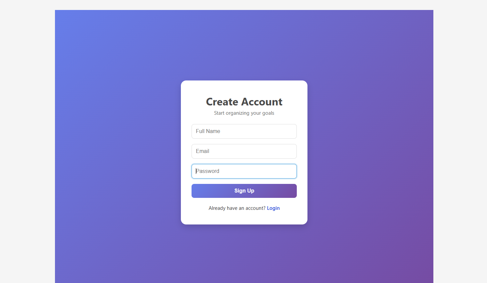
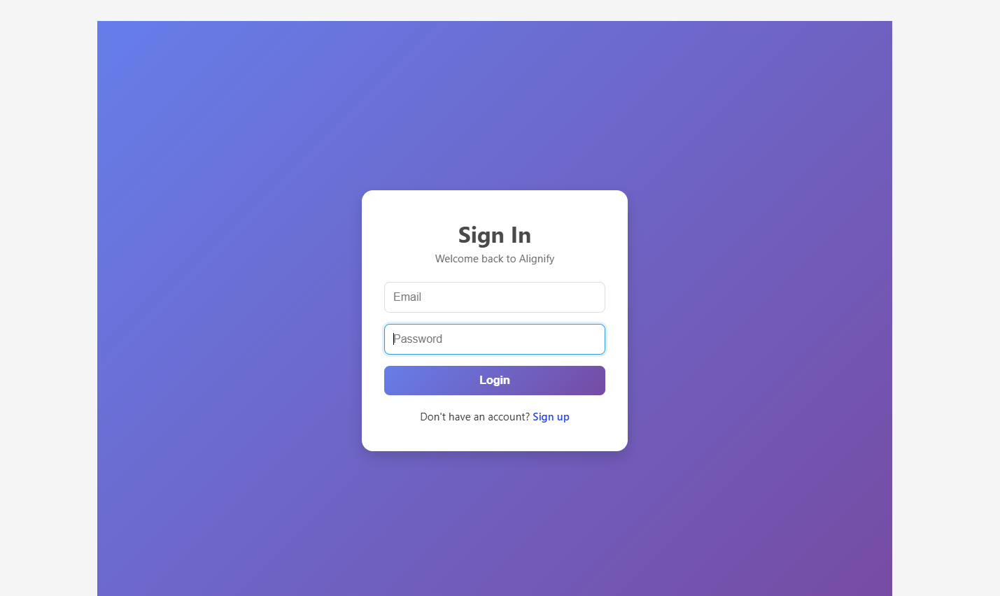
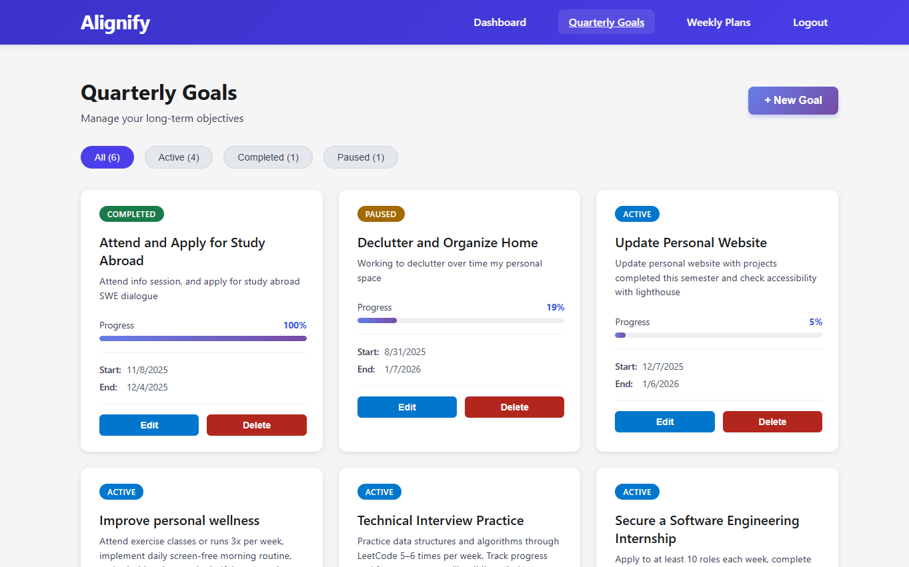
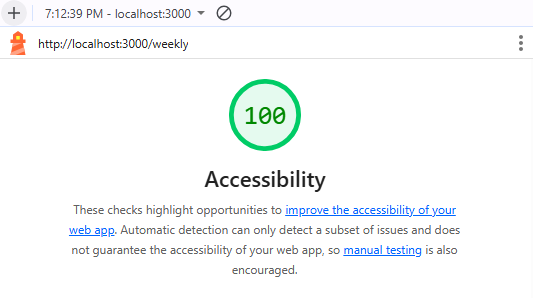

# Final Project: Alignify

## Authors

Navaneenth Maruthi & Rowan Lowden

## Relevant Links

[Web Link](https://alignify-6va4.onrender.com)

[Class Link](https://johnguerra.co/classes/webDevelopment_online_fall_2025/)

[Design Document](/Project%203%20Design%20Document.pdf)

[Google Slides](https://docs.google.com/presentation/d/1RoRdEvL57Q36DXU1fCk8MdS7CqbpqZLKZj4_6eoGr9U/edit?usp=sharing)

[Video Demo]()

[Usability Study](https://docs.google.com/document/d/14mqtL3fPA4ubc_VmA1cszDvEuumyuZvEmoSKxCS3jZ4/edit?usp=sharing)

## Project Description

Alignify is a full-stack productivity web app that helps users plan and execute their goals across quarterly, weekly, and daily timeframes. Built with React, Node.js, Express, and MongoDB, it supports intentional progress toward meaningful objectives.

For our final project CS5610, we iterated on the app based on findings from our usability study and the devtool "lighthouse". We improved layout clarity and the discoverability of key features. We also made accessibility updates, including higher-contrast color choices, consistent action colors, semantic heading order, improved spacing and alignment, screen-reader-friendly structure, and keyboard functionality. These changes resolved all Lighthouse accessibility issues and created a more inclusive, user-friendly experience.

## Features

### User Management

- 🔐 Secure authentication with bcrypt password hashing
- 🔑 Persistent login sessions stored in MongoDB
- 👤 Protected routes and user-specific data

### Quarterly Goal Management

- ✏️ Create, read, update, and delete quarterly goals
- 📅 Set goal deadlines and track progress with visual progress bars
- 🏷️ Categorize by horizon (quarter/month) and status (active/completed/paused)
- 📊 Filter goals by status for focused planning
- 🎯 Real-time progress calculation across all active goals

### Weekly Planning

- 📆 Create, read, update, and delete weekly plans
- 🔗 Link weekly plans to quarterly goals to maintain alignment
- ✅ Define weekly priorities and action items
- 📝 Write weekly reflections for continuous improvement
- 📋 Delegate daily tasks to accomplish weekly plans

### Dashboard Overview

- 📊 View overall progress at a glance
- 📈 See total and active goals count
- 🎯 Monitor active quarterly goals with progress visualization
- 💡 Quick actions for common tasks
- 🔄 Real-time data from MongoDB

## Tech Stack

**Frontend:**

- React 19 with Hooks (useState, useEffect)
- React Router DOM for client-side routing
- Vite for fast development and building
- PropTypes for component validation
- CSS3 with component-based organization

**Backend:**

- Node.js + Express 5
- RESTful API architecture
- Native MongoDB driver (no Mongoose)
- bcryptjs for password hashing
- JSON Web Tokens for authentication
- cookie-parser for session management

**Database:**

- MongoDB Atlas

**DevOps & Infrastructure**

- Docker - Container platform for MongoDB

**Development Tools**

- Nodemon - Auto-restart development server
- ESLint - Code linting and quality checks
- Prettier - Code formatting
- dotenv - Environment variable management
- Git - Version control

## Screenshots







## Design and Accessibility

### Design

**Color Palette:**
We updated our color palette to improve accessibility and ensure consistent visual meaning across the entire app. Lighthouse identified several low-contrast elements, so we shifted to darker, WCAG-compliant blues, purples, and neutral grays to maintain readability and support users with visual impairments.

Our primary action elements now use a consistent dark blue that represents progress and productivity, while delete/destructive actions use a high-contrast red applied uniformly across pages. Status badges (Active, Completed, Paused) were also updated to meet contrast requirements while preserving their intended meaning.

These changes provide:

- Clear distinction between approval vs. cancel actions
- Stronger visual hierarchy and improved text legibility
- A cohesive color system aligned with the app’s productivity purpose

Key updates include:

- Primary action buttons (Edit, Add Task): \* From a lighter blue → #0050A4

- Destructive actions (Delete): \* From soft red → #C62828

- Status badges:

  - Active → #0050A4
  - Completed → #1B873D
  - Paused → #c7610eff

- Headings and metric labels:
  - Primary text → #1B1E21
  - Secondary text → #3B434A

Overall, the revised palette resolved Lighthouse contrast failures and enhanced the user experience by making key actions and information easier to see and understand.

We used the following resources to help us with color and contrast
https://color.adobe.com/create/color-wheel
https://accessibleweb.com/color-contrast-checker/

**Typography:**
This application uses a system UI font stack to provide a clean, familiar, and highly readable interface across devices. Because productivity and goal-management tools require users to quickly scan and process information, the focus of the typography is clarity rather than decorative styling. System fonts are specifically optimized for user interface readability on each operating system (e.g., San Francisco on macOS/iOS, Segoe UI on Windows, Roboto on Android), which creates a native and trustworthy feel. Additionally, because these fonts are already installed on user devices, they require no external downloads—resulting in faster loading times, better performance, and improved accessibility. This typography choice aligns directly with the purpose of the application by reducing distractions and supporting efficient task-focused interaction.

- apple-system — macOS & iOS UI font (San Francisco)
- BlinkMacSystemFont — Chrome on macOS (San Francisco)
- Segoe UI — Windows UI font
- Roboto — Android + ChromeOS UI font
- Oxygen — KDE Linux desktop font
- Ubuntu — Ubuntu Linux desktop font
- Cantarell — GNOME Linux desktop font
- Fira Sans — Firefox OS font
- Droid Sans — Older Android UI font
- Helvetica Neue — Fallback for older Apple systems
- sans-serif — Generic fallback if none of the above are available

## ⌨️ Keyboard Navigation & Accessibility

Alignify is fully accessible and can be used entirely with a keyboard, making it inclusive for users who rely on keyboard navigation or assistive technologies.

### Keyboard Shortcuts

| Key           | Action                                         |
| ------------- | ---------------------------------------------- |
| `Tab`         | Navigate forward through interactive elements  |
| `Shift + Tab` | Navigate backward through interactive elements |
| `Enter`       | Activate buttons and links                     |
| `Space`       | Toggle checkboxes and activate buttons         |
| `Escape`      | Close modals and dialogs                       |
| `Arrow Keys`  | Navigate dropdown menus                        |

### Lighthouse

After our updates to Alignify, the Lighthouse accessibility checker passes at 100% for all pages of Alignify!



## Instructions

### Prerequisites

- Node.js (v20 or later)
- MongoDB Atlas account (free tier)
- Git

### Step 1: Clone the Repository

```bash
git clone https://github.com/rlowden22/Alignify.git
cd Alignify
npm install
```

### Step 2: Install Backend Dependencies

```bash
cd backend
npm install
```

### Step 3: Install Frontend Dependencies

```bash
cd ../frontend
npm install
```

### Step 4: Configure Environment Variables

Create a `.env` file in the **root directory**:

```bash
cd ..
touch .env
```

Add the following to your `.env` file:

```env
# Server Configuration
PORT=5001
NODE_ENV=development

# MongoDB Connection
MONGODB_URI=your_mongodb_atlas_connection_string_here

# JWT Secret (generate random string)
JWT_SECRET=your_super_secret_jwt_key_change_this_in_production

# Cookie Settings
COOKIE_MAX_AGE=86400000
```

**Replace `your_mongodb_atlas_connection_string_here` with your actual MongoDB Atlas connection string.**

### Step 5: Start the Application

**Terminal 1 - Backend:**

```bash
cd backend
npm run dev
```

**Terminal 2 - Frontend:**

```bash
cd frontend
npm run dev
```

### Step 6: Access the Application

- **Local Development:** http://localhost:3000
- **Backend API:** http://localhost:5001

You should see:

**Backend:**

```
✅ Connected to MongoDB Atlas
✅ Server running on http://localhost:5001
📊 Environment: development
```

**Frontend:**

```
VITE ready in XXX ms
➜  Local:   http://localhost:3000/
```

## Use of AI

- Navaneeth- Use AI for creating Dashboard CSS where we have overall progress to get circle completion and also for better version for Dashboard CSS.
- Rowan- I used Claude AI to help troubleshoot issues with daily task lists and checkbox toggle. I also used it to help deploy using render.

## License

MIT License
